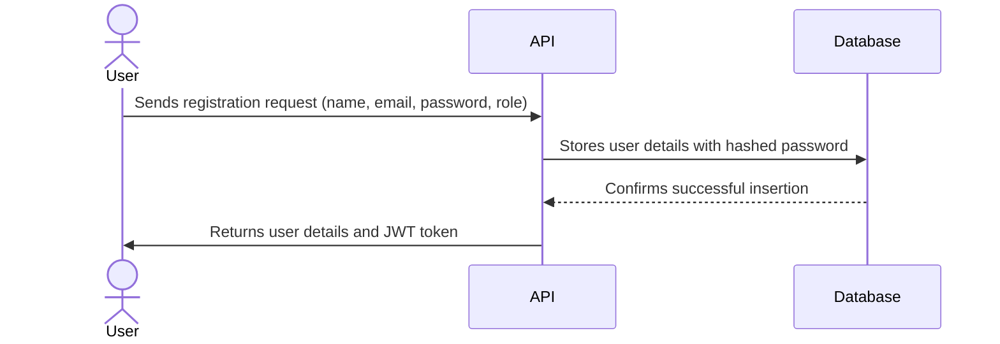
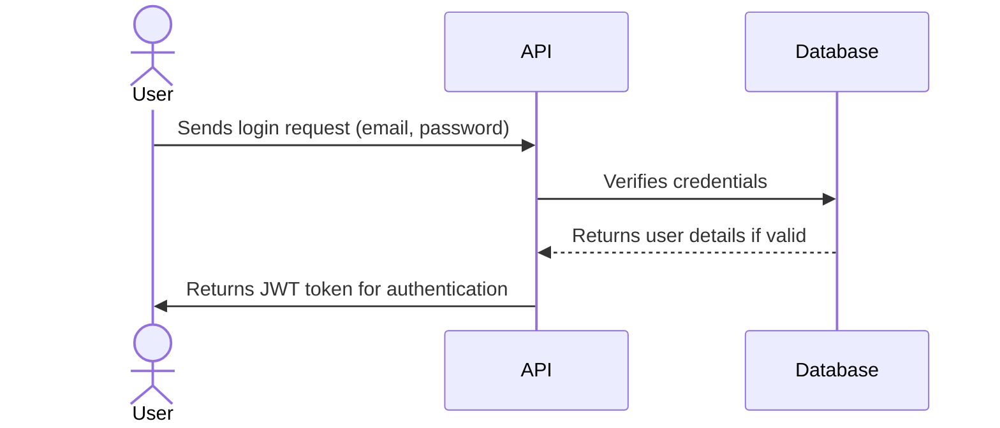
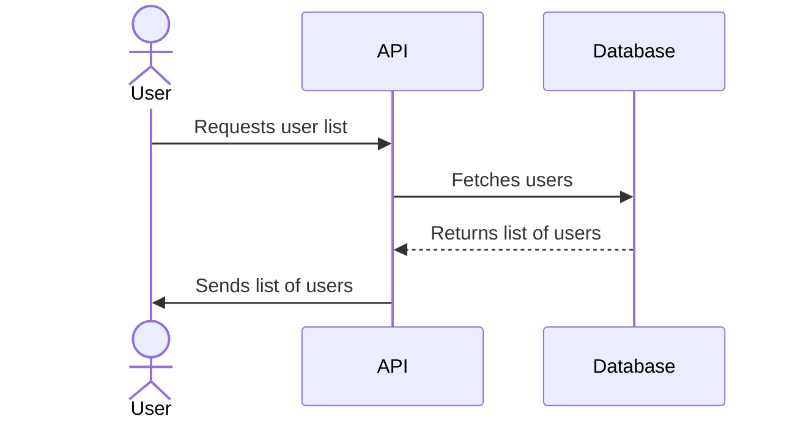
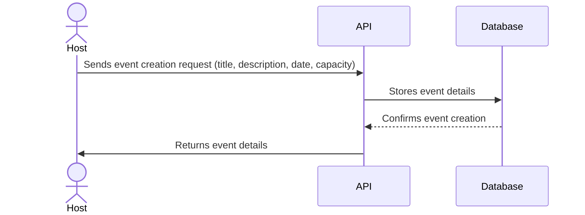
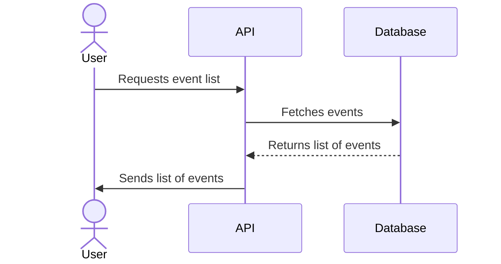
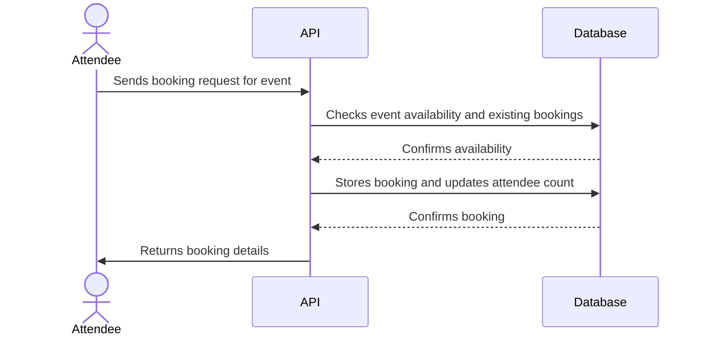
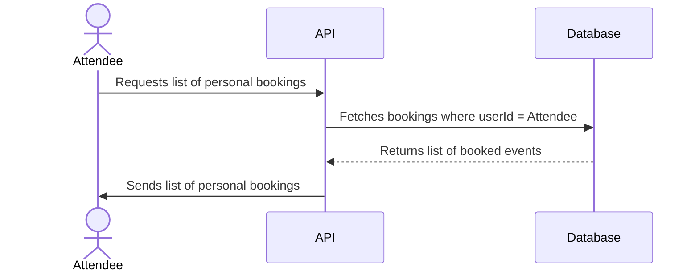
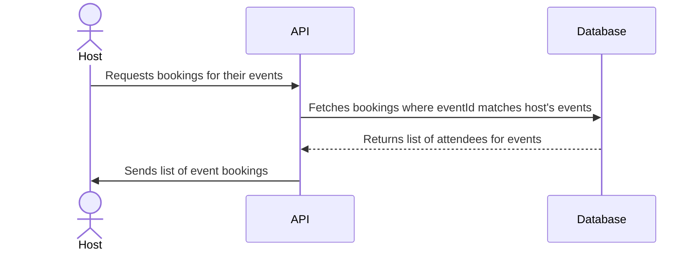

# Event Booking System Documentation

## Overview
A scalable, containerized Node.js application to demonstrate CRUD operations using SQL, docker orchestration, kubernetes deployment, and pub/sub mechanisms. This project is to recap modern backend development practices.

This system allows two types of users:
- **Event Hosts**: Users (e.g., bands or organizers) who can create and manage events.
- **Attendees**: Users who can browse events and make bookings to attend them.

---

## Features
- **User Management**: Create, update, delete, and list users.
- **Event Management**: Event hosts can create, update, delete, and list events.
- **Booking Management**: Attendees can book tickets for events.
- **Notifications**: Real-time notifications for event updates using Pub/Sub.
- **Database Transactions**: Ensuring atomic updates when processing bookings.

---

## Stateless Architecture
The **Event Booking Service** follows a **stateless architecture**, meaning:
- Each request is **independent** and does not rely on server-side sessions.
- Authentication is handled using **JWT tokens**.
- Scaling is simple since any instance of the service can handle a request.
- Consistency is enforced via **database transactions** to maintain event capacities.

This design enables **horizontal scaling**, making the system more resilient and distributed.

---

## Objectives
- Demonstrate SQL CRUD operations with PostgreSQL.
- Containerize the application using Docker.
- Orchestrate services using Docker Compose and Kubernetes.
- Implement Pub/Sub communication using RabbitMQ or Kafka.
- Integrate database transactions for atomicity.
- Illustrate software architecture using UML diagrams.

---

## Progress

### 1. Set up repository
- ✅ Initialized a Git repository.
- ✅ Configured `.gitignore` to exclude sensitive files like `.env` and unnecessary files like `node_modules`.
- ✅ Set up a basic `README` file with project information.

### 2. Set up DB, basic route, and tests
- ✅ Configured Sequelize with **PostgreSQL** as the database.
- ✅ Created the database schema for `Users`, `Events`, and `Bookings`.
- ✅ Updated seed scripts for `upSeedDB` and `downSeedDB` to work with PostgreSQL.
- ✅ Set up a basic route (`GET /users`) and tested it with seeded data.
- ✅ Installed and configured Jest for unit and integration tests.

### 3. Containerization
- ✅ Created a `Dockerfile` for the Node.js app.
- ✅ Set up `docker-compose.yml` to include:
  - The Node.js application.
  - PostgreSQL database.
  - Exposed ports for local testing and development.
- ✅ Configured commands for running and stopping the Docker environment in `package.json`.

### 4. Add authentication
- ✅ Implement user registration (`POST /auth/register`).
- ✅ Implement user login with JWT (`POST /auth/login`).
- ✅ Protect sensitive routes with JWT middleware.
- ✅ Role-based access control:
  - Hosts can create, update, and delete events.
  - Attendees can book events and view their bookings.

### 5. Add all CRUD routes
#### 5.1 Users
- ✅ `GET /users`: Retrieve all users with optional filters (e.g., by role).
- `GET /users/:id`: Retrieve a specific user by their ID.
- `PUT /users/:id`: Update user details (e.g., name, email).
- `DELETE /users/:id`: Delete a user and cascade related entities (e.g., hosted events).

#### 5.2 Events
- ✅ `POST /events`: Allow hosts to create an event, with fields like `startDateTime` and `endDateTime`.
- ✅ `GET /events`: Retrieve all events with filters (e.g., by date or host) and pagination.
- `GET /events/:id`: Retrieve a specific event by its ID.
- `PUT /events/:id`: Update event details (e.g., description or date).
- `DELETE /events/:id`: Delete an event and cascade bookings.

#### 5.3 Bookings
- ✅ `POST /bookings`: Allow users to book an event.
- ✅ `GET /bookings`: Retrieve all bookings with pagination.
- `GET /bookings/:id`: Retrieve a specific booking.
- `DELETE /bookings/:id`: Cancel a booking.

#### 5.4 Filtering, Pagination, Sorting
- Add query parameters like `?limit=10&offset=0&sort=date&order=asc` for:
  - Users
  - Events
  - Bookings

### 6. Ticket Sale Notifications
- Users can **express interest** in an event before tickets go on sale.
- Notifications will be sent when the sale starts.

### 7. Follow Hosts
- Users can follow event hosts to receive automatic notifications about new events they create.

### 8. Payment System Integration
- Implement **Stripe Sandbox** for secure payments.
- Attendees can book events using **test credit card details**.

### 9. Add email notifications
- Kafka service to handle email notifications to decouple, for scalability and fault tolerance.

### 10. Deploy application
- Plan deployment strategy for production, including environment variable management and scaling options.

---

## Design Decisions & Enhancements

### Database Transactions for Bookings
To ensure data consistency when creating a booking:
- A **database transaction** is used to:
  1. Check event availability.
  2. Lock the event row to prevent race conditions.
  3. Verify if the attendee has already booked the event.
  4. Increment the `numberOfAttendees` field atomically.
  5. Create a booking entry.
- If any step fails, the transaction automatically rolls back, ensuring consistency.

---

## **Database Schema**

### **Tables**

#### **Users**
Manages application users.

| Column Name | Type   | Description                           |
|-------------|--------|---------------------------------------|
| `id`        | UUID   | Primary Key                          |
| `name`      | STRING | Name of the user                     |
| `email`     | STRING | Email address (unique)               |
| `role`      | ENUM   | Role of the user: "host" or "attendee"|
| `password`	| STRING | Hashed password for authentication    |

#### **Events**
Tracks events hosted by users.

| Column Name         | Type    | Description                              |
|---------------------|---------|------------------------------------------|
| `id`                | UUID    | Primary Key                              |
| `title`             | STRING  | Title of the event                       |
| `description`       | TEXT    | Description of the event (optional)      |
| `startDateTime`     | DATE    | Start date and time of the event         |
| `endDateTime`       | DATE    | End date and time of the event           |
| `hostId`            | UUID    | Foreign Key referencing `Users(id)`      |
| `capacity`          | INTEGER | Maximum number of attendees allowed      |
| `numberOfAttendees` | INTEGER | Current number of attendees booked       |

#### **Bookings**
Tracks event bookings by users.

| Column Name | Type   | Description                              |
|-------------|--------|------------------------------------------|
| `id`        | UUID   | Primary Key                              |
| `userId`    | UUID   | Foreign Key referencing `Users(id)`     |
| `eventId`   | UUID   | Foreign Key referencing `Events(id)`    |

---

### **Relationships**

1. **Users and Events**:
   - A user (role: "host") can host multiple events.
   - Relationship: `User.hasMany(Event, { foreignKey: 'hostId', as: 'hostedEvents' })`.

2. **Users and Bookings**:
   - A user (role: "attendee") can book multiple events.
   - Relationship: `User.hasMany(Booking, { foreignKey: 'userId', as: 'bookings' })`.

3. **Events and Bookings**:
   - An event can have multiple bookings by users.
   - Relationship: `Event.hasMany(Booking, { foreignKey: 'eventId', as: 'eventBookings' })`.

---

# User Flows

This section illustrates the interaction of users (hosts & attendees) with the system via different API routes.

## **1. User Registration (`POST /auth/register`)**

## **2. User Login (`POST /auth/login`)**

## **3. List Users (`GET /users`)**

## **4. Create Event (`POST /events`)**

## **5. List Events (`GET /events`)**

## **6. Create Booking (`POST /bookings`)**

## **7. List Personal Bookings for Attendee (`GET /bookings` as Attendee)**

## **8. List Event Bookings for Host (`GET /bookings` as Host)**

